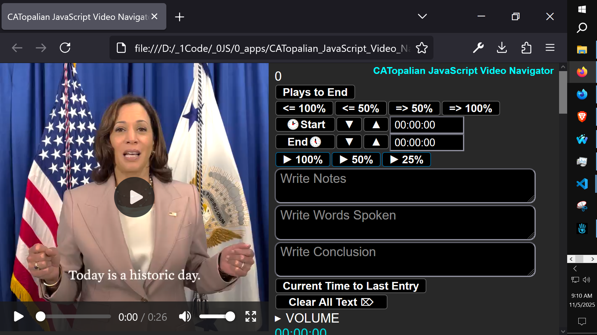
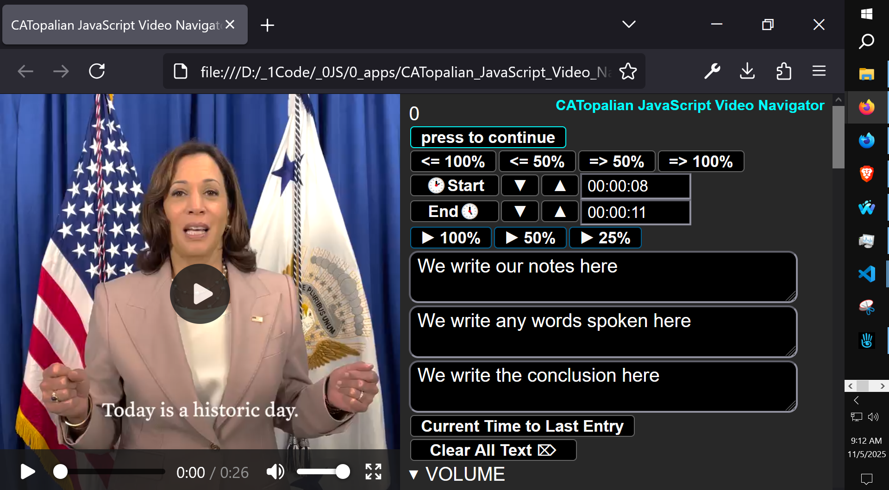
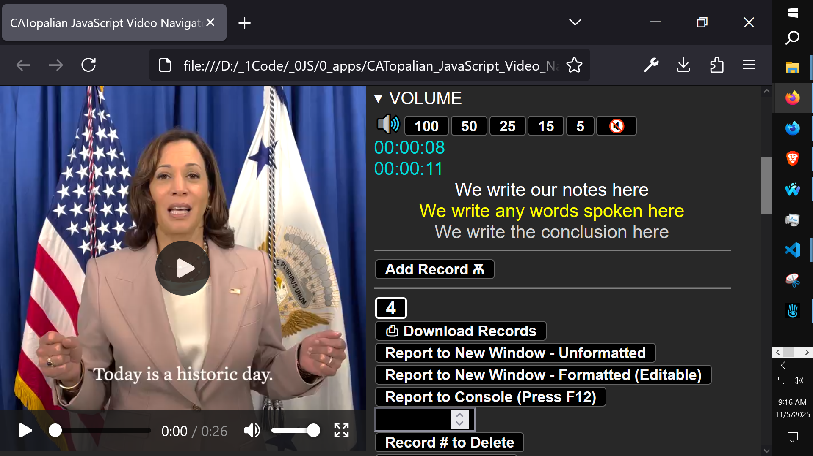
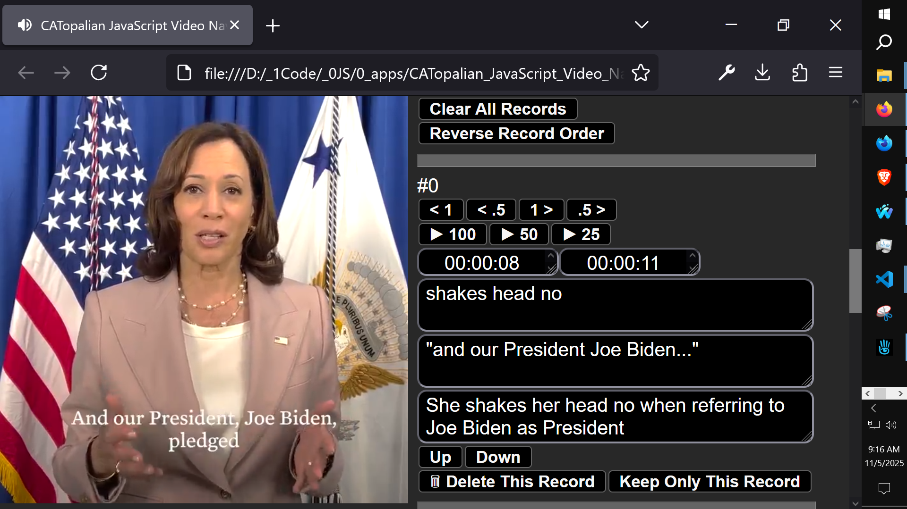
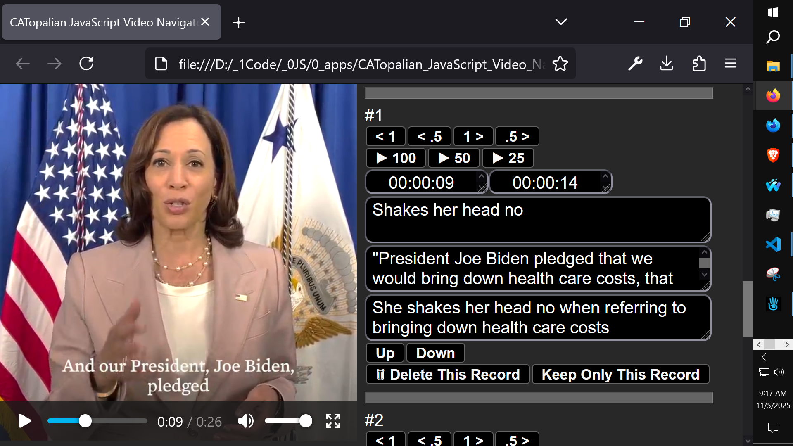
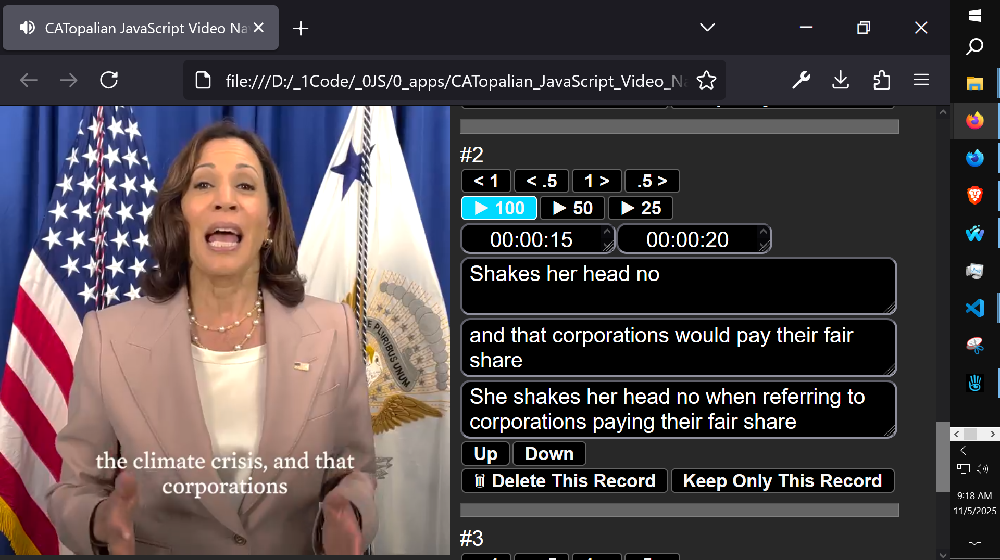

# CATopalian JavaScript Video Navigator
A JavaScript Video App that makes studying and organizing video data very easy and efficient.

---

Video: https://www.youtube.com/watch?v=vwLxzrJCvhg

---

How to Download this App
1. Click the green Code Button on this github page
2. Choose Download ZIP
3. Save the Zip File
4. Extract All
5. Double click the html file to start the App

---

//----//

// Dedicated to God the Father  
// All Rights Reserved Christopher Andrew Topalian Copyright 2000-2025  
// https://github.com/ChristopherTopalian  
// https://github.com/ChristopherAndrewTopalian  
// https://sites.google.com/view/CollegeOfScripting

